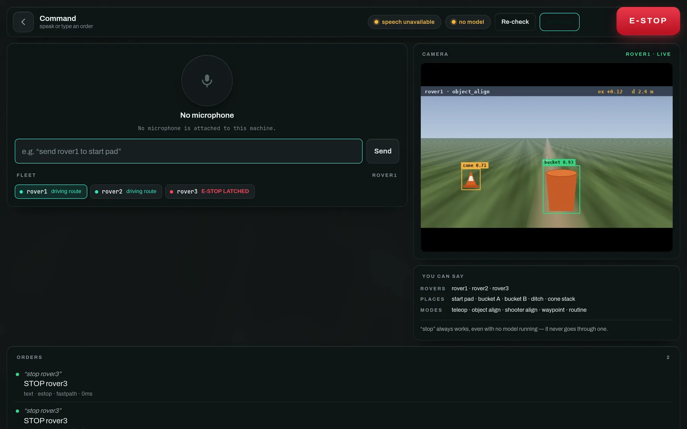

# 8 · Command it by voice, by typing, or from an AI

*One whitelist, one confirmation gate, one audit log — whoever is asking.*

Tap the microphone in the command dock to open a screen built for talking: hold
<kbd>Space</kbd>, say the order, and watch the transcript, the parsed command and
the fleet's reaction in one place. Speech is recognised **on the base station**
with faster-whisper and classified by a **local Gemma in LM Studio**, so the
whole path works with no internet.



Captured with neither half installed — the badges say **speech unavailable** and
**no model**, and typing still works. The two `STOP rover3` orders in the log
went through the keyword fast path, which is the whole point of it.

## Setting it up

```bash
# speech recognition — on this machine, no internet, no API key
pip install faster-whisper
# fetch the weights ONCE while you still have signal (~150 MB)
python -c "from faster_whisper import WhisperModel; WhisperModel('base.en')"

# the language model: LM Studio (or any OpenAI-compatible server).
# load google/gemma-3n-e4b, start the local server on :1234. That's it.

python run_basestation.py --sim   # both are auto-detected
```

A competition car park is not where you want to discover the weights are not
cached.

## Three properties that matter

**"Stop" never goes through the model**
: It is matched on the raw transcript before any HTTP request, so LM Studio
being closed, slow or mid-download cannot sit between the word and the rover.
Rover names, modes and the camera take the same fast path, which is why those
feel instant while a full sentence takes about 700 ms.

**Nothing dangerous on a 4B model's say-so**
: Firing, arming, jogging and raw drive return a pending card a human taps; it
expires after 45 seconds. Everything else is validated against live state first
— an unknown rover or an unsaved place is refused with a message naming what
*does* exist.

**Both halves are optional**
: With no model, keyword commands and typing still work. With no faster-whisper,
everything except the microphone. The screen says which you have. Flags:
`--no-voice`, `--llm-url`, `--llm-model`, `--stt-model`.

## Things that work

| Say | What happens |
|---|---|
| `stop` · `all stop` · `stop rover2` | E-stop, **without the model** |
| `rover two` · `switch to rover three` | Selects it, everywhere |
| `teleop` · `put it in waypoint mode` | Mode change |
| `rover1 align to the bucket` | Sets the target label, *then* enters object align |
| `send rover2 to bucket A then start` | Routes through both saved places |
| `show me rover3's camera` | Selects it and pulls up the FPV |
| `what is rover2 doing` | Answers from live telemetry |
| `run the collect cones routine` · `collect cones` | **Asks first** — starts a routine you built and named |
| `stop the routine` | Ends it and returns to teleop — never asks |
| `fire` · `arm the shooter` | **Asks first** — a card you tap |

Routines are matched by the name you typed in the editor, not by the id it
generated, and only against the ones actually loaded on the rover being
addressed — the *You can say* panel lists them, so what is on screen is exactly
what will be understood. Both forms above work with no model running.

## Letting Claude — or any AI — command the fleet

`basestation/mcp_server.py` is a stdio MCP server. It connects to a *running*
base station over the same WebSocket the dashboard uses, which is the point: an
AI gets exactly the dashboard's authority — the same whitelist, the same
confirmation gate, the same audit log — because it goes through the same front
door. The tool list is *generated* from the same intent registry the voice
interface uses, so the two cannot drift.

```bash
# see exactly what an AI could do, before you connect one
python -m basestation.mcp_server --list-tools
```

```json
{"mcpServers": {"rover": {
  "command": "python", "args": ["-m", "basestation.mcp_server"],
  "env": {"RS_BASE_WS": "ws://127.0.0.1:8000/ws"}}}}
```

`get_fleet` translates telemetry into words a model can reason about ("sees:
bucket, centred: true" rather than `ex: 0.03`). Tools whose intent needs
approval say so in their description and return "waiting for a human" — the
operator taps the card at the base station.
