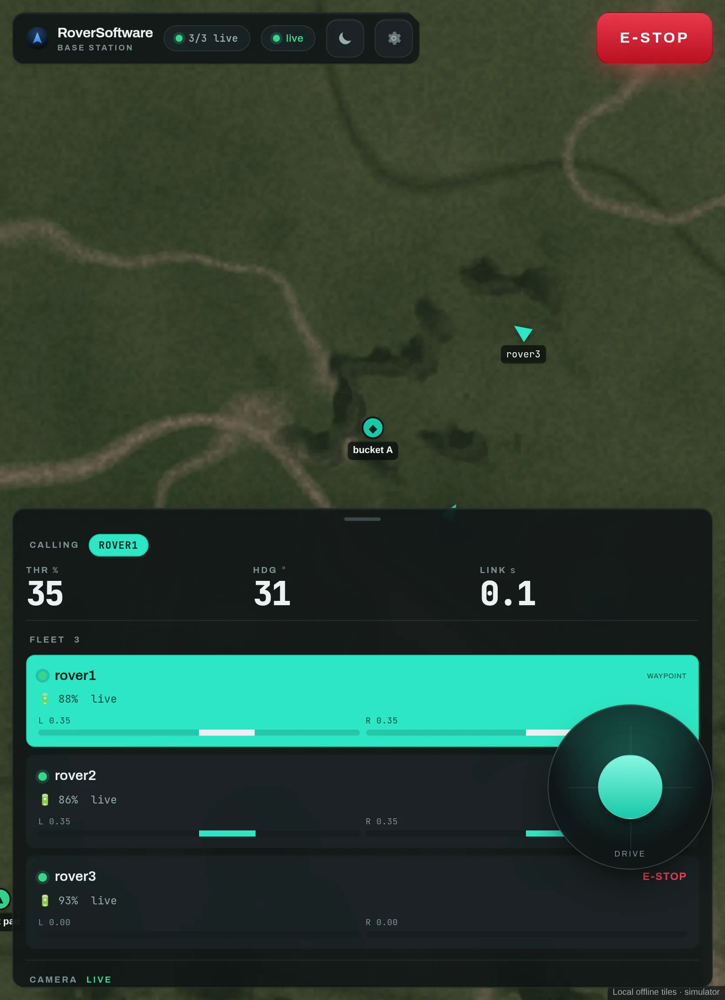

# 9 · Put it on the robot

*A Debian package, a systemd service, and one command to iterate.*

There are two ways onto a rover, and they are for different moments.

- **[`apt install`](../install/apt.md)** — the released build. Right for a rover
  that has to come up on its own after a power cut, and for anyone who is not
  you. Start there.
- **`just deploy` / `just sync`** — your working tree, over SSH. Right for the
  twenty times an hour you change a gain and want to feel it. That is what this
  page is about.

## The development loop

Everything is driven by [`just`](https://github.com/casey/just), pointed at a
robot by hostname (default `rover1.local`).

```bash
# ONCE per robot: SunFounder Fusion HAT drivers + the fusion_hat library
just bootstrap
just reboot                        # if bootstrap asks for it

# first-time / clean install: builds the .deb, installs it, sets up the service
just deploy                        # → rover1.local
just host=rover2.local deploy      # a different robot

# FAST iteration: rsync changed code into /opt/roversoftware and restart,
# with no packaging round-trip
just sync

# service and logs
just status
just logs                          # journalctl -u roversoftware-robot -f
just restart
just config                        # edit robot.env, then restart
```

`just sync` rsyncs `robot/`, `run_robot.py` and `tools/` straight into
`/opt/roversoftware` and restarts the service. Use `deploy` only when the systemd
unit, the dependencies or the env file change.

> **Give each rover a unique `RS_ROBOT_ID`**
>
> Frames are addressed by id on a shared channel, and two rovers answering to
> the same name will both take every command.

## Running the robot by hand

```bash
python run_robot.py --port /dev/serial0 --baud 9600
```

| Flag | What it does |
|---|---|
| `--mode object_align` | Start in a mode other than teleop |
| `--mock-motors` | No Fusion HAT: mock them, for comms testing |
| `--fpv --fpv-host <ip>` | Stream the camera to the base station (needs LAN) |
| `--heading-source gps` | Track angle only, no IMU |
| `--vision-backend imx500` | Run detection on the AI Camera's sensor |
| `--no-gps --no-imu` | Bench work indoors |
| `--telemetry-hz N` | Lower to free airtime on a slow radio |

## The base station as a touchscreen kiosk

The dashboard ships as its own package for a Raspberry Pi with a screen. It
installs the Python bridge on an internal port (`RS_WEB_PORT`, default 8001),
the Deno UI on the public port (`RS_UI_PORT`, default 8000), and a desktop
autostart entry that launches a full-screen Chromium kiosk pointed at it on
boot.

```bash
just bs_host=base.local bootstrap-deno       # ONCE: the deno runtime
just bs_host=base.local deploy-basestation   # builds the UI + installs the .deb

just bs_host=base.local sync-ui              # fast: rebuild + push the UI
just bs_host=base.local bs-reload            # refresh the kiosk browser
just bs_host=base.local bs-ui-logs           # what the UI service is saying
```

**The Deno runtime is not on apt** — install it once with `bootstrap-deno`, or
the bridge still runs, just without the UI.



The portrait layout, for a tablet or the official 7″ 800×480 panel. The bottom
sheet collapses, the map keeps the space, and the stop button stays where it
was. Large tap targets, iPad safe-area insets, and locally-bundled map and fonts
— no CDN, so it works fully offline.

## When the loop is over

Once the code is worth handing to someone else, tag it and let CI build the
packages, the desktop binaries and the apt index:
[Cutting a release](../reference/releasing.md).
