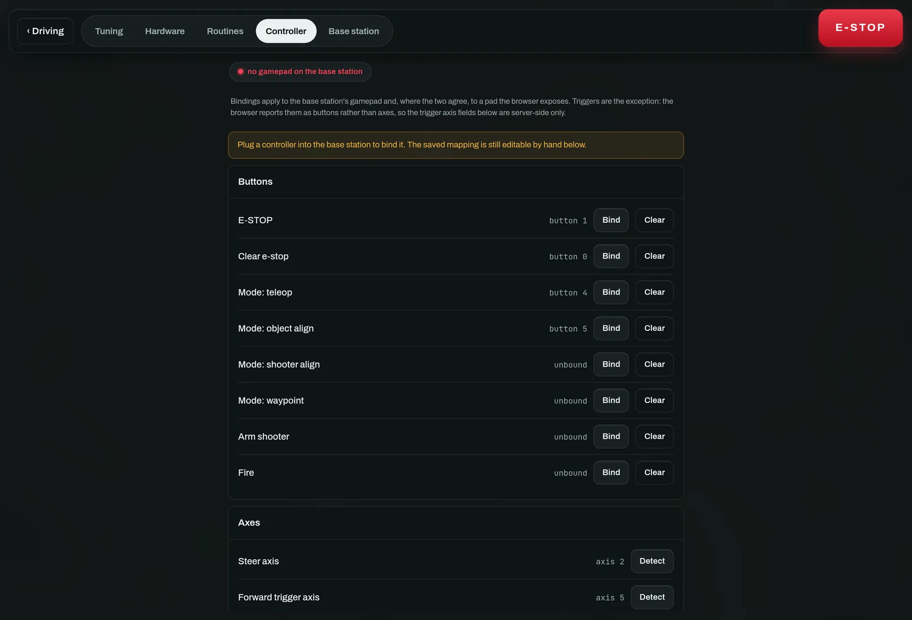

# 3 · Drive a rover

*A gamepad on the base station, or the touch joystick in the browser.*

1. Tap a rover in the fleet list. Everything that follows applies to it.
2. Make sure it is in **Teleop**. The mode grid is under *Control* in the rail.
3. Drive it: hold the on-screen pad, or use a gamepad — <kbd>R2</kbd> forward,
   <kbd>L2</kbd> reverse, right stick to steer.

**Plug the gamepad into the base station, not into the tablet.** It is read
there by the bridge process itself and its commands go straight out over the
radio. A pad connected to whatever machine is showing the dashboard does
nothing: the browser has no part in the physical-controller path, so a laggy
socket, a reconnect or a backgrounded tab cannot come between a trigger pull and
a rover moving.

Both inputs produce a throttle and steer in `-1 … +1` and both are rate-limited
to the bridge's `drive_hz`, which is one shared airtime budget. That is why a
physical pad and a tablet joystick feel identical, and why two operators cannot
flood the radio between them.

> **Failsafe**
>
> Teleop stops the robot if drive commands stop arriving (`command_timeout`).
> Walking out of radio range parks the rover rather than leaving it at its last
> throttle. E-stop overrides every mode until it is explicitly cleared.

## If the gamepad's buttons are wrong

They will be. Axis and button indices describe a *driver*, not a controller —
the same pad enumerates differently on macOS and Linux, over USB and over
Bluetooth. **Settings → Controller** remaps it by *pressing the control you
want*, with a live view of every axis and button and the throttle/steer the
current mapping produces.

Also here: dead zone, trigger rest value (a trigger that idles at `-1` instead
of `0` is normal), throttle and steer authority, and steering inversion. This
replaces editing constants and restarting a service.

### If it feels twitchy rather than wrong

Reach for **expo** before authority. Authority scales everything, so it buys
fine control by giving up top speed; expo bends the middle of the travel down
and leaves the endpoint where it was. At `0.6`, half stick gives `0.28` instead
of `0.5` and full stick still gives `1.0`. `0` is the linear stick, which is
what every build had before the curve existed.

Leaving the dead zone no longer steps: the remaining travel is rescaled back
onto the full range, so just past centre is near zero rather than jumping
straight to the dead-zone value. That means you can raise the dead zone to
cover a worn, drifting stick without making the twitch worse.

### Driving on a stick instead of the triggers

Set **Throttle axis (stick)** to a stick axis and the drivetrain comes off the
triggers entirely, which frees both to be ordinary buttons. Sticks report up as
negative, so **Invert throttle stick** is on by default; it does not affect the
trigger layout. The mixing is unchanged either way — it happens on the robot,
so both layouts put the identical thing on the radio.

## The buttons a gamepad also carries

Beyond driving, the mapped pad can e-stop, clear, switch mode, and arm or fire
the launcher. All of it is remappable on the same page, and all of it goes
through the same whitelist a spoken order does.

**Shooter spin / shot** is the launcher by hand while you drive, and is not the
same button as *Fire*: that one is the aligned, armed, dwelled shot and carries
all of those rules. This one carries none of them — it is refused only by the
e-stop and by a running routine. What it does depends on the build: on a
flywheel (`shooter.target_rpm` above `0`) it toggles the wheel between speed and
stopped, because a wheel takes seconds to spin up and holding a button for a
whole match is nobody's idea of a control; on a servo launcher it fires one
shot.

Two things you write yourself go on buttons too, in slots further down that
page: a **routine**, and a **mechanism preset** — the named states from
[Hardware](hardware.md), so `intake → in` is a thumb rather than a trip to
another tab. A preset latches until something else changes it, so a mechanism
you drive both ways wants two buttons (`in` and `out`); give it an auto-stop in
Hardware if it should also give up on its own. Presses are ignored while a
routine is running, which owns the mechanisms until you switch back to teleop.
