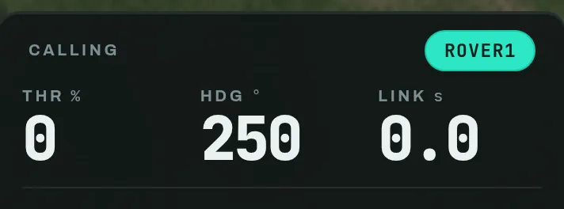
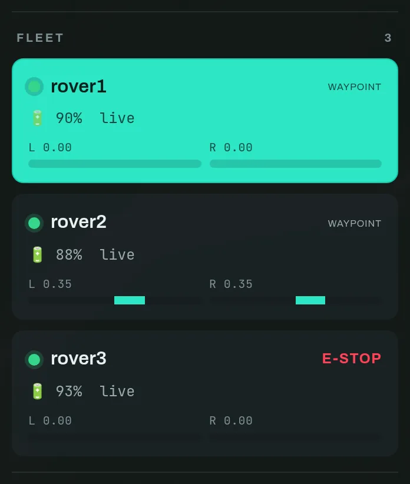
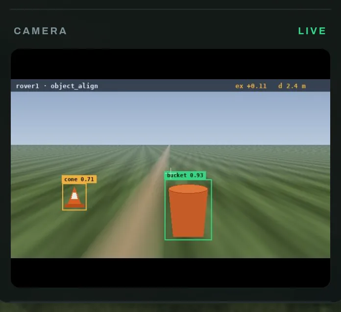
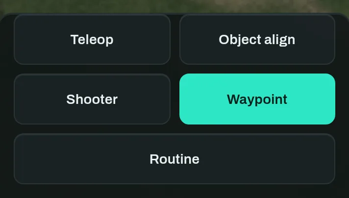
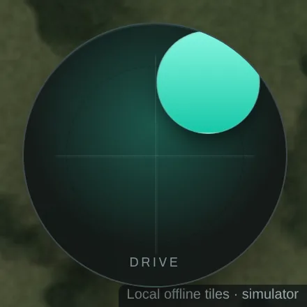
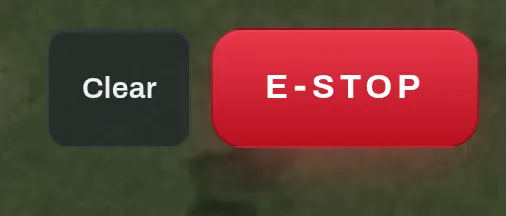
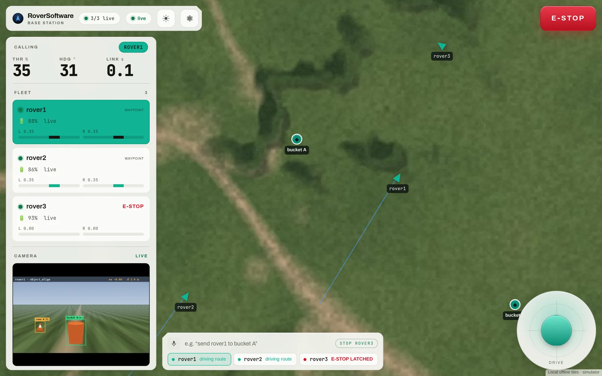

# 2 · Read the driving view

*Six things on one screen, arranged by how often you look at them.*

The rail runs top to bottom in order of urgency. The board leads, because those
are the numbers you read from across a bench; the fleet list below it is how you
change which rover they are about.

## The board

Throttle, heading, and the age of the last packet. `LINK` climbing is the first
sign of a radio problem.

## The fleet

Mode, battery, link and live track speeds per rover. Tap one to **select** it —
the teal fill is the only thing that ever means "the rover you are calling".
Note rover3, latched.

## The camera

JPEG-over-UDP from the robot, served as browser-native MJPEG. Green is the
object `object_align` is tracking; amber is everything else it can see.

FPV needs WiFi, not the radio — 57600 baud cannot carry a camera. Start the
robot with `--fpv --fpv-host <base-ip>`.

## The telemetry rows

Under the fleet: mode, position, heading, GPS fix health, wheel speed, battery,
what the detector sees, and the link. Each carries a colour that means the same
thing everywhere — grey is "nothing to say", green is fine, red wants you.

The **wheels** row appears only on a build with
[encoders](hardware.md#the-encoder-if-this-motor-has-one) fitted, and it is the
one number the rest of this screen cannot give you: `left`/`right` on the fleet
row are what the rover was *told*, and this is what the wheels actually *did*. It
leads with the gap between the two sides rather than the two speeds, because the
gap is what you are watching for — a rover that curves shows it here before the
map catches up. See
[Wheel speed matching](tuning.md#making-both-tracks-turn-together).

## Modes

One is always active. Switching is instant and reversible; the drive layer does
not change.

Under the grid, **Routines** lists the state machines this rover is carrying, by
the name you gave each one — see [Routines](routines.md). Tapping one selects and
runs it, which is the fifth mode; the running one shows the step it is in, and a
**Stop** below returns the rover to teleop. Nothing is listed until you have
built one, because "run a routine" is not something an operator wants — running
a *particular* routine is.

## The pad

Up is throttle, sideways is steer. It releases to zero and rate-limits to the
radio's budget.

## The stop

Above every other layer, on every screen — including the one where you are
editing drive limits. *Clear* only appears once something is latched.

## Two renditions

The sun/moon button in the top bar is a **field control**, not a preference.
Dark is right in a pit; the 7″ panel outdoors needs *daylight*, because sunlight
on glass beats any dark UI. The choice is remembered per device, so the kiosk
that boots outdoors and the laptop indoors never fight.

Same identity, same geometry, same grammar — only the light changes, and the
accent darkens so the contrast ratio against its own ink holds.
