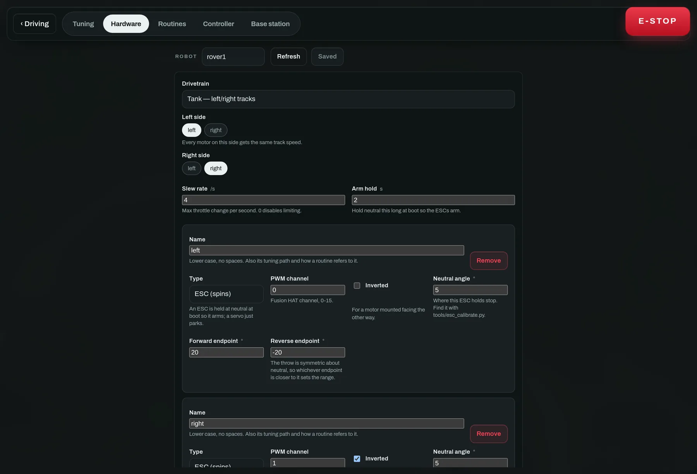
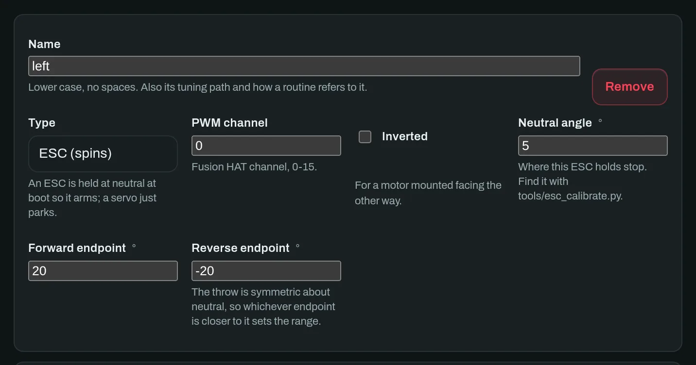
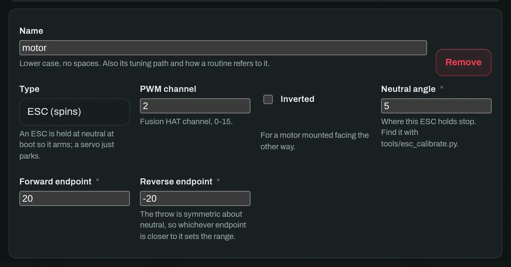
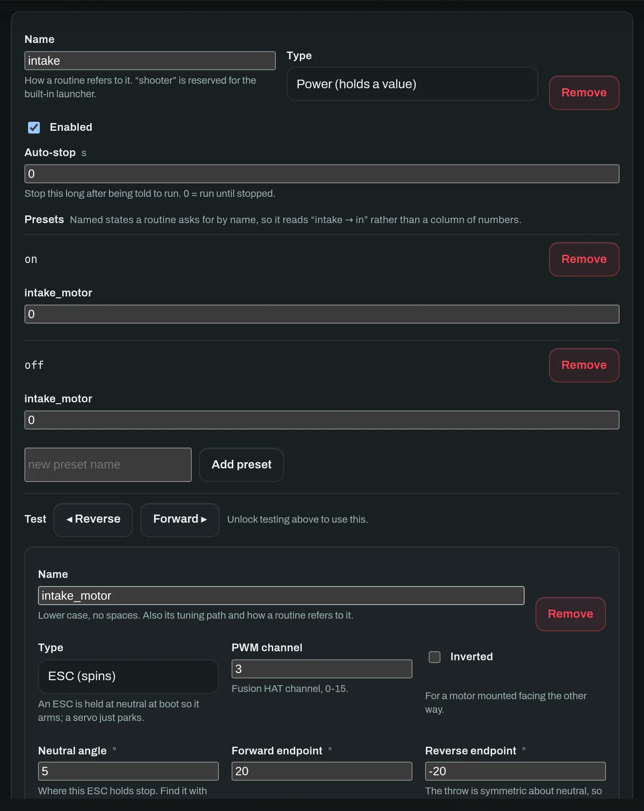

# 5 · Describe your hardware

*Settings → Hardware. What the robot HAS, written from the dashboard.*

Nothing about your build is compiled in. The **layout document** says which
drivetrain you have, how many motors and servos are fitted, and what the rest of
them are grouped into. Change it from the tab, save it to the robot, restart,
and the robot is a different machine.

The tab is a draft you edit locally and send in one go — unlike the tuning page
next door, which applies each field as you change it. A layout is a **tree**, and
half a tree is a robot with one drive motor.

## 1 · Pick the drivetrain

| Kind | What it is | What you then assign |
|---|---|---|
| `tank` | Two sides, skid steer | Which motors are on the *left* side and which on the *right*. Every motor on a side gets that side's track speed, so a six-wheeler is three names on each list. |
| `servo_steer` | Drive motor plus a steering servo | The drive motors, the steering servo, a *steering gain* and a *pivot creep*. |
| `single` | One motor, no steering | The drive motors only. |
| `none` | No drivetrain at all | Nothing — for a fixed platform that is all mechanism. |

> **A steered chassis cannot pivot on the spot**
>
> …and object align and waypoint mode both ask it to. **Pivot creep** is what
> makes that survivable: it creeps forward so the steering bites. Set to zero,
> the rover will steer at its target without ever moving.

## 2 · Add a motor

Press **+ Motor** at the bottom of the drivetrain card. You get a fresh actuator
card with the fields below; fill them in and it exists.

*An existing motor. Every field carries the sentence you would otherwise have
had to find in the source.*

*A motor added just now. It starts on a free channel and a safe neutral, so an
unfinished card cannot arm anything.*

**Name**
: Lower case, no spaces. It is also this actuator's tuning path and how a
routine refers to it, so `intake_motor` is worth more than `m3`.

**Type**
: **ESC (spins)** is held at neutral at boot so it arms; **Servo (holds a
position)** simply parks. Pick wrong and an ESC will refuse to arm.

**PWM channel**
: The Fusion HAT channel, `0–15`. Claiming a channel twice is *refused* —
silently making two motors move together is not a thing this page will do to
you.

**Inverted**
: For a motor mounted facing the other way. On a tank chassis the right side is
almost always mirrored, so this is almost always ticked on one side.

**Neutral angle**
: Where *this* ESC holds stop. Find it with `tools/esc_calibrate.py`; do not
assume it is zero.

**Forward / reverse endpoint**
: The ends of the throw. The throw is **symmetric about neutral**, so whichever
endpoint is closer to neutral sets the usable range — which is what keeps a
normal and a mirrored motor starting together and matching speed even when
neutral is not centred.

> **Order matters**
>
> Add the motor here first, then assign it to a side in the drivetrain card
> above — the *Left side* and *Right side* pickers list the actuators that
> exist, so a motor you have not created yet cannot be assigned.

### The encoder, if this motor has one

Press **Add** in the Encoder row at the bottom of the card. Optional, and off on
every motor until you do — a motor without one simply runs open-loop, exactly as
the rover always has.

Why bother: everything else on this page commands a *throttle*, and a throttle
is a wish rather than a speed. Two motors handed the same pulse turn at
different rates — different ESCs, different gearbox friction, weight off centre,
one track on grass — so the rover drives a slow arc while every number in the
dashboard reports a straight line. An encoder is the only thing that can see
that, and [Wheel speed matching](tuning.md#making-both-tracks-turn-together) is
what then corrects it.

**A pin / B pin**
: **BCM GPIO numbers on the Pi header — not the PWM channel above.** They are
different buses, and mixing them up is the first mistake everyone makes here; it
presents as an encoder that counts nothing at all. Set both or neither: one
channel of a quadrature encoder decodes nothing, and the robot refuses a layout
that sets only one. Claiming a pin twice is refused for the same reason a PWM
channel is, and a worse one — two actuators reading one pin count the same edges,
so a rover with one genuinely dragging track would report both wheels at exactly
the same speed.

**Counts per rev**
: Counts per revolution **of the wheel**, gearbox included. *Measure this, do not
derive it* — the number on the encoder is per revolution of the motor, this
decoder counts four edges per cycle, and the printed gear ratio is frequently
not the real one. Run `python tools/encoder_monitor.py --pins 17,27`, zero it,
turn the wheel exactly one full turn by hand, and read the count.

**Count inverted**
: Tick it if a wheel counts *down* when driving forward. Separate from
**Inverted** above: that one mirrors the motor, this one mirrors the sensor, and
a mirrored track motor usually needs both.

The pins are read through `fusion_hat`, the same library that drives the motors,
so there is nothing extra to install: if the motors move, the encoders can be
read — see [Wiring and calibration](../reference/wiring.md).

## 3 · Group the rest into mechanisms

Anything that is not drive is a **mechanism**: an intake, an arm, a launcher. A
mechanism owns one or more actuators and comes in two kinds.

**Powered**
: Holds a value until told otherwise — an intake that spins, an arm that holds
an angle. Give it named **presets** like `in`, `out` and `stow`, so a routine
asks for *"intake → in"* rather than a column of numbers. *Auto-stop* ends the
motion after N seconds; `0` runs until stopped.

**Pulse**
: Owns a cycle: rest angle, active angle, active time, recover time, cooldown
and a magazine count. Asking it to fire repeatedly still yields one activation
per cycle, which is what makes a launcher safe to wire to a condition that stays
true.

A powered mechanism with two presets and its own actuator. The **Test** row jogs
it from the bench — and is refused unless the robot is in teleop with no e-stop
latched, because a bench test that runs while a routine owns the motors is how a
hand ends up in an intake.

## 4 · Save it

Press **Save to robot**. The layout is sliced into numbered fragments, and
*nothing is applied until every fragment arrives* — then the robot validates the
whole document, stores it, and echoes the stored copy back, because the
validator clamps and what was saved is not always what was sent. Errors come
back naming the state or field that was wrong.

> **A saved layout takes effect on the next start**
>
> Actuators are built by constructors; rebuilding them mid-loop with the
> drivetrain armed is how an ESC ends up holding an undefined pulse. Run
> `just restart`, `sudo systemctl restart roversoftware-robot`, or power-cycle
> the rover.

Before you trust any of it, calibrate the ESCs —
[Wiring and calibration](../reference/wiring.md) is the wheels-off-the-ground
procedure.
