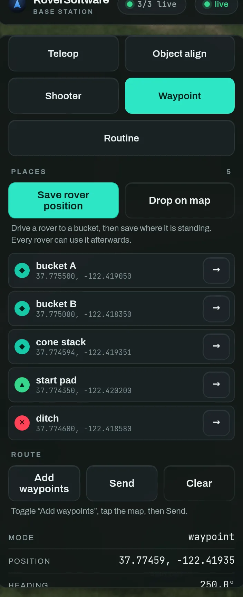
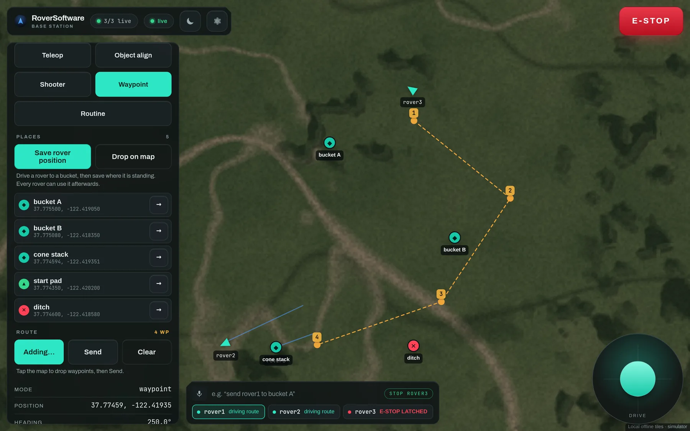
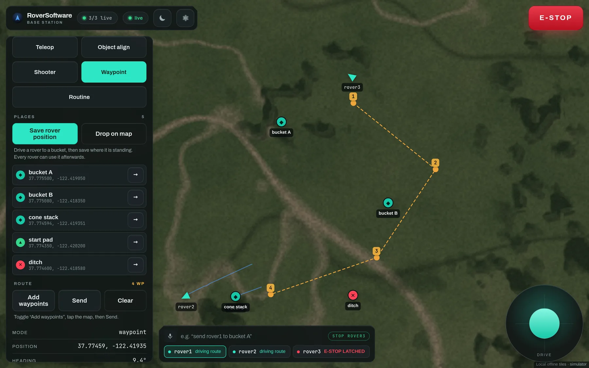

# 4 · Save places, then send a route

*Name the field once; build a run out of it every match.*

A **place** is a named position on the field, saved on the base station and
shared by every rover. The best way to make one is to drive a rover until it is
standing on the thing and press *Save rover position* — that is more accurate
than any amount of squinting at imagery, and it is the reason the button sits
next to the driving controls rather than behind a menu.

Places carry a **kind** — bucket, marker, start, hazard — which is what the
glyph on the map means. Tap `→` on a row to push it onto the pending route.

## Dropping a route on the map

1. Press **Add waypoints** under *Route*.
2. Tap the map where you want the rover to go. Points are numbered as you drop
   them.
3. Press **Send**. The rover switches to waypoint mode and starts driving it.

Waypoints are amber because they are a *plan* — proposed, not yet done. As the
rover reaches each one, its own trail is drawn in teal behind it. **Clear**
discards a route you have not sent.

Mid-draw. Four points dropped, **nothing sent yet** — the route is still a plan
you can add to or clear, and the rover is still in whatever mode it was already
in.

A sent route. The rail shows the mode has flipped to `waypoint`, and the command
dock at the bottom reports what every rover is doing at once — *driving route*,
*aligning on target* — so you can see the fleet without changing selection.

> **Navigation needs a heading**
>
> With no compass the robot uses the GPS module's *track angle* — true North, no
> calibration — which is meaningless standing still, so a BNO085 IMU is
> preferred when one is fitted. Pick with `--heading-source auto|gps|imu`.

## Why places, rather than coordinates

A routine that refers to a *place* follows it when you move it. Re-survey
"bucket A" on the morning of the event and every routine that drives to it is
correct, with nothing re-edited. Coordinates typed into a state machine are
correct exactly once.
