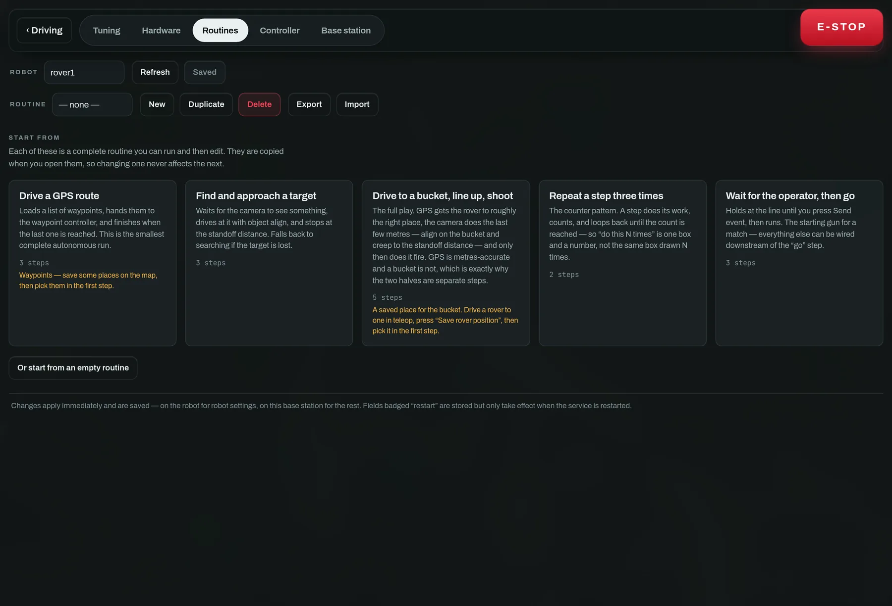
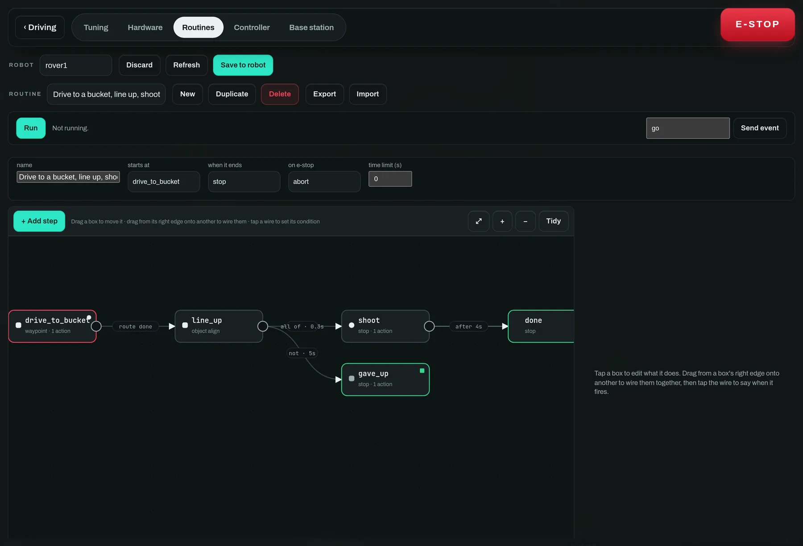

# 6 · Program it without writing Python

*Settings → Routines. A state machine you draw, that runs on the robot.*

A **routine** is a state machine on a canvas. Each box is a step: it says what
drives, what happens when the robot enters, holds and leaves it, and what makes
it move on. Saved routines run *on the robot*, so they survive losing the radio —
and the box the robot is actually in lights up as it runs, which is what turns
the editor into something you can debug a match with.

Start from a template rather than an empty canvas. Each one is a complete
routine you can run and then edit; they are copied when opened, so changing one
never affects the next. Amber text on a card names a **prerequisite** — a saved
place you need before it will do anything.

## The canvas

- **Drag a box** to move it. **Tidy** re-lays out the whole graph.
- **Drag from a box's right edge onto another box** to wire them together.
- **Tap a wire** to say when it fires.
- **Tap a box** to open the inspector and edit what it does.

The full play. GPS gets the rover roughly to the right place, the camera does
the last few metres, and only then does it fire. GPS is metres-accurate and a
bucket is not, which is exactly why the two halves are separate steps.

## What a step contains

The inspector for one step. **Drives with** is the only thing that commands the
motors — no action drives, so exactly one thing owns them at any moment.

**Drives with**
: `Stop`, `Hold position`, `Fixed throttle/steer`, `Teleop` (hand it back to the
driver), or **delegate** to `Object align`, `Shooter align` or `Waypoint route`.
Delegation is how the graph composes the autonomy that already exists rather
than re-expressing it.

**When entered**
: Runs once. Set a mechanism to a preset, load a GPS route, arm the launcher,
add one to a counter.

**Action while here**
: Runs every tick, at the control-loop rate. Right for holding a mechanism at a
power; wrong for counting, which is why *count this* belongs in *when entered*.

**When leaving**
: Runs however the state is left — including a timeout, an abort or an e-stop.
The right place to disarm something.

**Then**
: The transitions, **checked in order, first match wins, at most one per tick**.
Order is meaning: put "gave up" below "succeeded".

## What a wire can wait for

| Group | Conditions |
|---|---|
| timing | after a delay · immediately · never (hold here) |
| vision | when the camera sees a target · when lined up · when at the standoff distance · **when the object is at a distance** |
| navigation | when the route is finished · when pointing a direction · when near a saved place |
| mechanism | after N shots · when a mechanism is ready |
| logic | ALL of · ANY of · NOT · after this has happened N times |
| operator | when I press a button · when the e-stop is latched |

**"When the object is at a distance"** is the one to reach for when *at the
standoff distance* is nearly right but not quite. They are different questions:
the standoff belongs to whichever align mode is driving and fires when that mode
decides it has arrived, while this one is a number in metres you name, tested
whatever is driving — so a state can hand over at 2 m on the way in, before any
approach finishes.

It measures one of two things, and picking the wrong one is how a routine stops
at the wrong object:

- **target** — how far away the *detected* object is. Measured by the ultrasonic
  while the target is centred in its beam, and read off the bounding box past
  that. Needs a detection.
- **ahead** — how far away the nearest thing *straight ahead* is, from the
  ultrasonic alone. Needs no model at all, which makes it the one for "creep
  forward until something is close" — and the wrong one for "until the bucket is
  close" in a room with a chair in it.

Fill in *within* to close in, *no nearer than* to wait until something is far
enough away, or both for a band. It is never true while the distance is unknown,
so a state waiting on one waits rather than proceeding on a number nobody has.
Take care asking for less than the collision guard's stop distance: the rover
halts there, and the transition never fires.

Every condition can additionally be required to **hold continuously** for a
number of seconds before it counts. That one field is the difference between a
launcher that fires on a single noisy frame and one that waits half a second to
be sure — it is the `0.3` on the wire out of `line_up` above.

## What an action can do

| Group | Actions |
|---|---|
| mechanism | set a mechanism to a preset · run one at a power · stop one · pulse one once · fire · arm / disarm the launcher |
| navigation | load a GPS route (from saved places) |
| logic | count this · reset a counter |

None of them drive. That is the state's `drive` source, which is what guarantees
exactly one thing commands the motors at any moment.

## Running it

1. **Save to robot.** Routines take effect the moment they land — they are data
   the engine reads, not hardware a constructor owns.
2. Press **Run**. The robot switches to `routine` mode and the live box lights
   up.
3. For a "when I press a button" wire, type the event name and press **Send
   event**. A press is cleared whenever a new state is entered, so it cannot
   satisfy a transition it was not meant for.
4. **Stop** ends the run. The e-stop does too, and the routine's *on e-stop*
   setting decides whether it aborts or holds.

A saved routine is not confined to this tab. Every one the robot carries appears
by name under **Routines** on the driving view, next to the mode buttons — one
tap selects and runs it, the running one shows the state it is in, and pressing
it again restarts it. It is also sayable: "run the collect cones routine", or
just its name. Naming a routine is therefore how you invoke it, so name it the
way you would ask for it out loud. Starting one by voice always asks for a tap
to confirm; stopping never does.

> **Test it dry**
>
> The simulator runs the real state-machine engine with the real validators. You
> can build, run and debug an entire competition routine against `--sim` and
> only then put it on a rover.

Routines **Export** to a JSON file and **Import** back, which is how you move one
between rovers or keep last season's in the repo.
