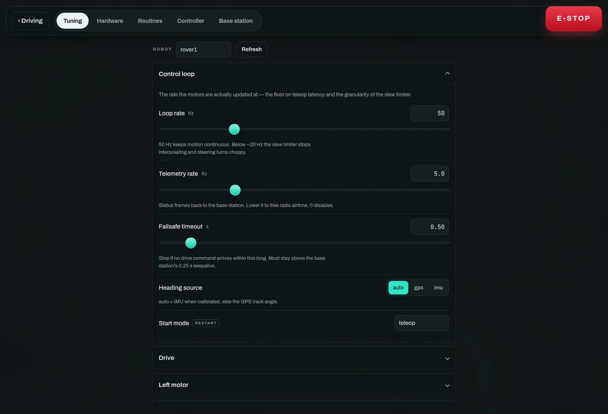
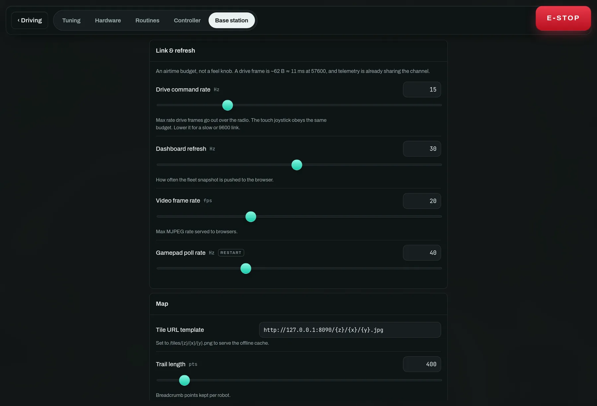

# 7 · Tune it in the field

*Settings → Tuning. Over the radio, live, and saved on the robot.*

Everything the dashboard is allowed to change is on this tab: PID gains for
object alignment and waypoint heading hold, drive limits and per-motor ESC
calibration, loop and telemetry rates, vision thresholds, shooter geometry and
firing policy, GPS/IMU and FPV.

Fetched when you open the tab rather than streamed: the full set is about
2.4 KB on a link shared with telemetry. On a robot running its own layout, the
per-motor groups are the ones **it** declared.

## Three rules worth knowing

**Clamped, not refused**
: Ask for a gain of 500 and you get the maximum, echoed back — so the field shows
what the robot is actually doing, not what you typed. A browser cannot reach an
arbitrary attribute: the tuning whitelist in `robot/tuning.py` decides which
paths exist and clamps every value.

**Badged "restart"**
: Serial ports, PWM channels and enable flags are stored immediately but only
take effect on the next start. The badge tells you which is which, so you are
never left wondering whether a change took.

**Saved on the robot**
: Robot settings persist on the robot, base-station settings on the base
station. Field tuning survives the next power cycle, and a rover carries its own
calibration to the next event.

## The base station's own settings

Radio airtime budget (`drive_hz`), dashboard refresh, video frame rate, basemap
URL and trail length. Point the basemap at a local tile server here for offline
field use.

## Watching a loop instead of guessing at it

A PID is the one thing here you cannot tune by watching the rover. "It wobbles"
does not say whether `kp` is too high or `kd` is doing nothing, and the loop runs
fifty times a second with every value in between thrown away.

Switch on **Graph the loops** (under Control loop) and each loop group grows a
pair of plots above its gains:

**Tracking**, in the loop's own units — the dashed line is where it is aiming,
the solid line is where it is pointing, and the shaded gap between them is the
error. What you want to see is the gap closing and staying closed.

**Output**, split into the P, I and D contributions that add up to it. These are
contributions, not gains: `kp` times the error, not `kp`. It answers the question
a gain by itself cannot — *which term is actually driving this?* A D trace that
never leaves zero is a `kd` that is not participating. An I trace that climbs and
stays up is wind-up. **at limit** means the output is pinned at `out_limit`, and
more gain will change nothing at all.

Hovering reads every series at that instant; **Clear** throws the history away,
which is what you want right after changing a gain — the next curve should be the
one your new value produced.

Two things to know. It is sampled at the **telemetry rate**, not the control
rate, so a wobble faster than half that rate aliases — raise *Telemetry rate*
while you look at it. And it costs airtime on every frame, on a radio shared with
driving: switch it on to tune, off to race.

## Making both tracks turn together

Everything above commands a throttle, and a throttle is a wish rather than a
speed. Two motors handed the same pulse turn at different rates, so the rover
curves away while every number on this page says it is going straight. If the
build has [wheel encoders](hardware.md#the-encoder-if-this-motor-has-one), the
**Wheel speed matching** group is what closes that gap — and the `wheels` row on
the driving view is where you watch it happen. That row leads with the *gap*
between the two sides, because the gap is the thing you are looking for; two
speeds side by side are two facts you then have to subtract.

**Mode** is the whole feature:

`off`
: Measure only. RPM still reaches telemetry, which is what you read to set the
other numbers here — so this is not a wasted setting.

`match`
: Hold the two sides to **each other**. Needs no calibration whatsoever, not
even counts-per-rev, because its error is a *difference* and a shared scale
factor cancels out of one. Start here. It only acts while you are driving
straight: a commanded turn is a difference you asked for, and correcting it would
fight the steering.

`velocity`
: Hold each side to `throttle × Max wheel RPM`. This also works in turns, and it
makes the throttle mean something repeatable — half throttle is the same wheel
speed on grass as on tarmac, until the motor runs out of authority. The price is
one honest measurement: drive flat out on the surface you will run on and read
**Max wheel RPM** off the `wheels` row. Too high and every setpoint is
unreachable; too low and the loop throttles back against a wall that isn't there.

Its gains are graphed like any other loop, in RPM. They look tiny next to the
alignment gains because the error is in RPM rather than in throttle units — the
same reason the heading loops' gains look tiny in degrees. Unusually, **the
integral is the term that matters here**: a pair of mismatched motors is a
constant bias, which is exactly what an integrator cancels and a proportional
term can only ever half-fix. `kd` ships at zero because its input would be a
differenced noisy measurement, which is noise with a gain on it.

> **What happens when an encoder falls off**
>
> A speed loop that keeps integrating against a sensor reading zero will wind
> that side to full throttle. So a wheel commanded above *Engage above* for
> *Stall timeout* with its encoder still reading a standstill trips a fault: the
> loop opens, the `wheels` row says which side, and it stays open until the
> drivetrain stops — an encoder that came loose cannot re-arm the loop while the
> rover is still moving. Setting the timeout to `0` disables that check, which is
> a bench-only thing to do.

You can try all of this with no hardware at all. The simulated rover has the
defect on purpose — its right side is 6% weaker — so `run_basestation.py --sim`
drives a visible arc on the map, and switching the mode to `match` straightens it
while you watch.

## A tuning order that works

1. **Drive limits first.** Slew rate and max throttle, until hand-driving feels
   controllable. Everything downstream inherits this.
2. **Then heading hold.** Waypoint mode with two points and nothing else
   running; raise `kp` until it oscillates, then back off a third. Watch the
   tracking plot rather than the rover — the oscillation shows there first.
3. **Then alignment.** Object align against a stationary target. The standoff
   distance is geometry, not a gain — measure it.
4. **Firing policy last**, and only with the launcher pointed somewhere safe.

Changing gains while a routine is running is legal and sometimes the fastest way
to find a value. It is also how you discover that the rover was mid-approach.
